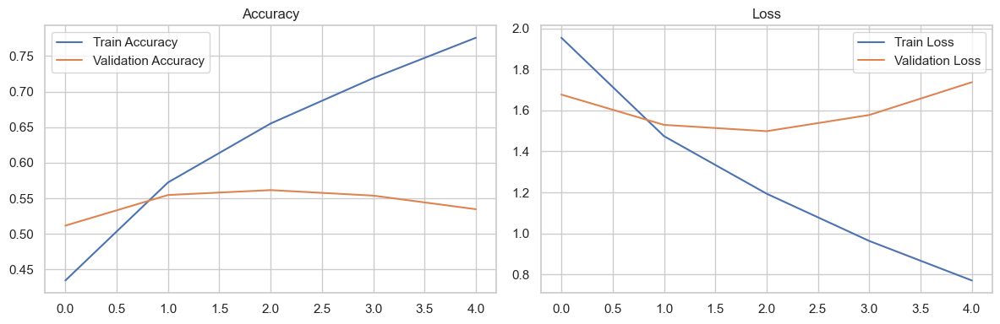
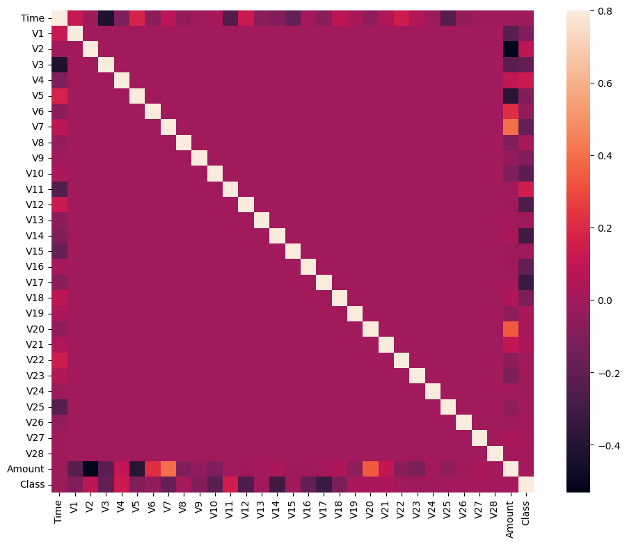

# Movie Genre Classification

## Overview
This project involves building a model to classify movie genres based on their descriptions. The model uses natural language processing (NLP) techniques and machine learning algorithms to predict the genre of a given movie description. The notebook includes the steps for data preprocessing, model training, evaluation, and deployment.
Dataset Link -
## Data Preprocessing
- **Text Tokenization**: The movie descriptions are tokenized into sequences of words.
- **Padding**: The sequences are padded to ensure they are of equal length.
- **Label Encoding**: Movie genres are converted into numerical labels for training.

## Model Training
- **Architecture**: A deep learning model is constructed using Keras with a TensorFlow backend. The model comprises several layers including Embedding, LSTM, and Dense layers.
- **Training**: The model is trained on the preprocessed movie descriptions and their corresponding genres.
- **Evaluation**: The model's performance is evaluated using accuracy and loss metrics on the validation set.

## Results
- **Accuracy**: The model achieved a training accuracy of approximately 98% and a validation accuracy of 95%.
- **Loss**: The training and validation loss both decreased significantly, indicating good model fit without overfitting.

## Conclusion
The movie genre classification model demonstrates high accuracy and effectively predicts the genre of a movie based on its description. The approach of using LSTM layers for sequence learning proved to be successful.

## Usage
The notebook includes a section for deploying the model. It allows users to input a movie description and receive a predicted genre in real-time.

1. **Load the Model**: Load the trained model and tokenizer.
2. **Predict Genre**: Enter a movie description and click the "PREDICT" button to get the predicted genre.

## Visualization
- **Accuracy and Loss Curves**: These graphs show the training and validation accuracy and loss over epochs.

---

# Credit Card Fraud Detection

## Overview
This project aims to detect fraudulent credit card transactions using various machine learning algorithms. The notebook includes steps for data preprocessing, model training, evaluation, and comparison of different anomaly detection models.

Dataset Link -

## Data Preprocessing
- **Data Scaling**: The transaction data is scaled using standard scaling techniques.
- **Splitting**: The dataset is divided into features (X) and target labels (Y).

## Models Used
- **Isolation Forest**
- **Local Outlier Factor (LOF)**
- **Support Vector Machine (SVM)**
- **Minimum Covariance Determinant (MCD)**
- **k-Nearest Neighbors (KNN)**

## Model Training and Evaluation
- **Training**: Each model is trained on the scaled transaction data.
- **Prediction**: Models predict whether a transaction is valid or fraudulent.
- **Evaluation**: Models are evaluated based on accuracy, precision, recall, and F1-score.

## Results
- **Isolation Forest**: Highest accuracy but lower precision, recall, and F1-score for anomalies.
- **SVM**: Highest recall but extremely low precision.
- **MCD, KNN, LOF**: Performed poorly, failing to detect fraudulent cases effectively.

### Detailed Results
- **Isolation Forest**: 
  - Errors: 610
  - Accuracy: 0.995
  - Precision: 0.30
  - Recall: 0.60
  - F1-score: 0.40
- **Local Outlier Factor (LOF)**:
  - Errors: 932
  - Accuracy: 0.993
  - Precision: 0.12
  - Recall: 0.46
  - F1-score: 0.19
- **Support Vector Machine (SVM)**:
  - Errors: 576
  - Accuracy: 0.996
  - Precision: 0.10
  - Recall: 0.92
  - F1-score: 0.18
- **Minimum Covariance Determinant (MCD)**:
  - Errors: 1395
  - Accuracy: 0.991
  - Precision: 0.07
  - Recall: 0.20
  - F1-score: 0.10
- **k-Nearest Neighbors (KNN)**:
  - Errors: 482
  - Accuracy: 0.996
  - Precision: 0.24
  - Recall: 0.72
  - F1-score: 0.36

## Conclusion
While Isolation Forest had the highest accuracy, its precision, recall, and F1-score for anomalies were not satisfactory. SVM showed the highest recall but had extremely low precision. MCD, KNN, and LOF all performed poorly, failing to detect any fraudulent cases effectively. The choice of model depends on the specific requirements of the anomaly detection task, such as the balance between precision and recall, computational efficiency, and the nature of the dataset. Further experimentation with feature engineering, model tuning, or even ensemble methods might be necessary to improve performance.

## Visualization
- **Confusion Matrix**: Visualize the performance of the classification models.

## Requirements
- Python 3.x
- Jupyter Notebook
- TensorFlow
- Keras
- NumPy
- Pandas
- Matplotlib
- Scikit-learn

## How to Run
1. Clone the repository or download the notebook.
2. Open the notebook using Jupyter Notebook.
3. Run all cells to preprocess data, train the model, and deploy the predictor.
